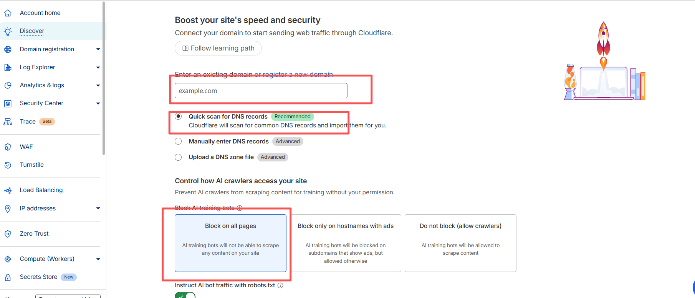

# gemini-proxy

通过cloudflare的woker免费搭建gemini的proxy,你需要准备

- cloudflare账号
- 拥有一个自己的域名

## 示例
```
from google import genai
from google.genai import types
from PIL import Image
from io import BytesIO

client = genai.Client(http_options=types.HttpOptions(base_url='https://customer_domain'))

prompt = (
    '帮我生成一张段正淳的图片'
)

response = client.models.generate_content(
    model="gemini-2.5-flash-image",
    contents=[prompt]
)
for part in response.candidates[0].content.parts:
    if part.text is not None:
        print(part.text)
    elif part.inline_data is not None:
        image = Image.open(BytesIO(part.inline_data.data))
        image.save("段王爷.png")
```

## 教程
- 登录cloudflare
- 导入自己的域名(必须，虽然woker会提供一个域名，但是没法用，你懂的~)

- 填写自己的域名(选择免费的plan就好了)

- 更改原本域名提供商的dns服务器为cloudflare的，复制cloudflare的dns服务器地址

- 更改域名提供商的dns为cloudflare的dns服务器地址，比如阿里云

- 创建woker

- 将gemini_proxy.js导入到woker

- 导入完成后，添加自定义域名即可
